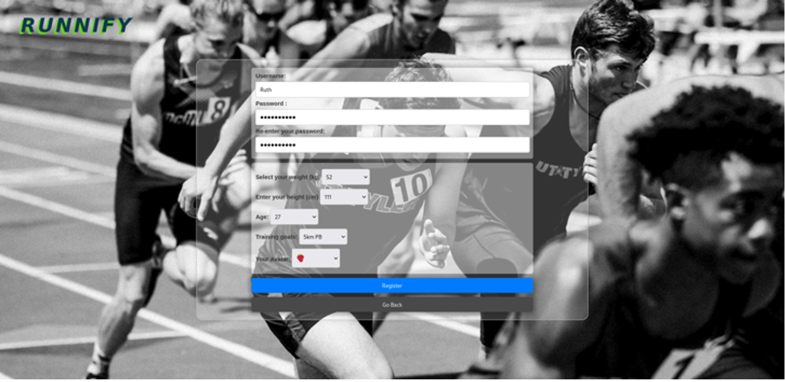
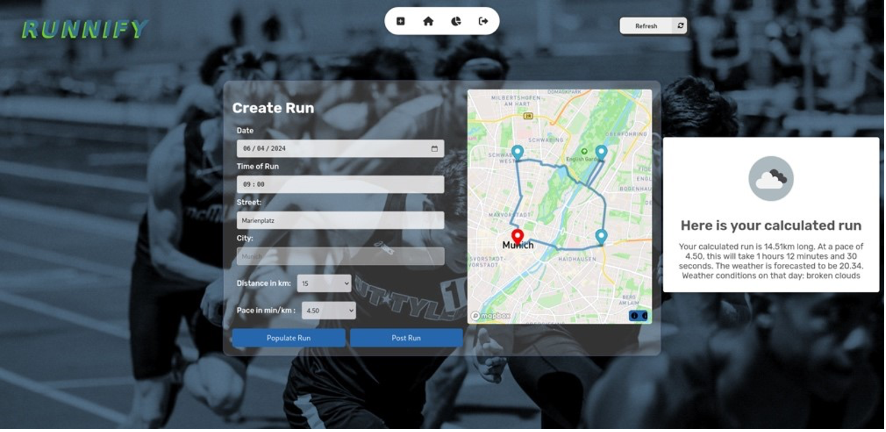
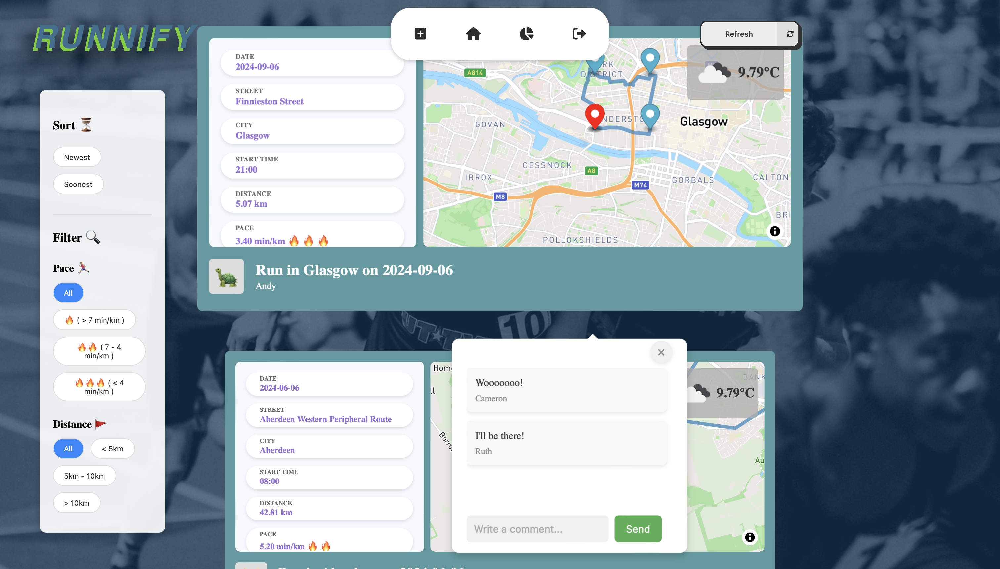
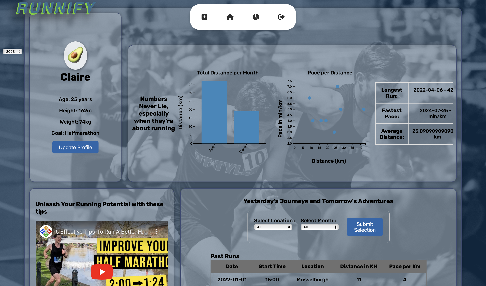

# **Runnify** 🏃‍♀️✨  
🌟 Your go-to platform for organising social runs and tracking your fitness journey in a fun, interactive way!

🌐 **[Try Runnify now!](https://runnify-web-f2150b469ce7.herokuapp.com)**  
🚨 *Note: Desktop-only access for now!*

---

## 🎯 **About Runnify**
Imagine a place where runners connect, collaborate, and conquer their fitness goals together. That’s what **Runnify** is all about! Designed and developed by a team of five students at the University of St Andrews, this full-stack web application serves as a social hub for runners to:

- Organise running activities.  
- Stay motivated with community support.  
- Track fitness goals and progress.

---

## ✨ **What Can You Do on Runnify?**
### 🔑 **Sign Up and Log In**  
Your journey starts here! Create an account or log in to unlock all the features.  

<div align="center">
    
    
</div>

---

### 🏃‍♂️ **Create Runs**
- Specify your desired **pace**, **start time**, **location**, and **distance**.  
- Get an **optimised route** with a weather forecast to plan your perfect run.  

<div align="center">
    
</div>

---

### 📰 **Discover Runs on the Feed Page**
- Browse runs with all the details: **routes**, **meeting points**, **pace**, and **participants**.  
- Interact by **liking**, **commenting**, or **joining** a run.  
- Use filters to sort runs by pace or distance to find what suits you best!  

<div align="center">
    
</div>

---

### 📊 **Track Progress with Statistics**
- Update your fitness goals regularly.  
- View interactive graphs to monitor your activity trends over time.  

<div align="center">
    
</div>

---

## 🚀 **How to Use Runnify**

### 1️⃣ **Set It Up**
Install all the necessary modules and dependencies:  
```bash
pip install node
npm install express express-session mocha chai mongodb
```

### 2️⃣ **Connect to the Database**
Run the following command to start your MongoDB instance:  
```bash
$HOME/Documents/mongodb/bin/mongod --dbpath $HOME/Documents/mongodb_data --logpath=$HOME/Documents/mongodb/mongodb.log --auth --port $(id -u) &
```

### 3️⃣ **Start the Server**
Launch the application locally:  
```bash
node main.js
```

### 4️⃣ **(Optional) Run Tests**
First, clear the database:  
```bash
mongosh --port $(id -u) -u webuser --authenticationDatabase admin -p
use mainDatabase
db.users.drop()
db.createRuns.drop()
```

Then, execute test cases:  
```bash
npm run test
```

---

## 🛠️ **Technologies Behind Runnify**
Here’s what powers the magic:

* **JavaScript**: Handles the application logic, retrieves data from the OpenWeather and GeoCoding APIs, and displays running routes using MapBox.
* **HTML**: Structures the web application and ensures a well-organized layout.
* **CSS**: Provides styling and layout for a visually appealing and responsive user interface.
* **Node.js**: Processes HTTP requests from the frontend (e.g., user logins, creating new runs, liking posts) and manages interactions with external APIs like OpenWeather and GeoCoding. It also facilitates communication with MongoDB for storing and retrieving data.
* **MongoDB**: Stores persistent data, including user information (e.g., usernames, passwords, preferences) and run-related data (e.g., route, pace, start time, distance, participants), as well as interactions like comments and likes.

---

## 🌟 **Acknowledgements**
A big shoutout to the following tools and APIs for making Runnify possible:  
* [OpenWeather API](https://openweathermap.org/api): Provides weather information used to predict conditions for future runs.
* [GeoCoding API](https://openweathermap.org/api/geocoding-api): Supplies the longitude and latitude of the starting point, allowing the plotting of optimal running routes.
* [MapBox](https://docs.mapbox.com/api/overview/): Displays the running routes on an interactive map for users to visualize their paths.
* [D3](https://d3js.org/): Generates the graphs that are shown on the statistics page.
* [SweetAlert2](https://sweetalert2.github.io/): Creates interactive pop-ups and alerts throughout the application.
* [Sessions](https://www.npmjs.com/package/express-session): Tracks user activity across different pages to maintain session state.
* [Mocha](https://mochajs.org/) & [Chai](https://www.chaijs.com/): Perform automated testing to ensure the application’s functionality and reliability.

---

## 👥 **Meet the Team**
| **Name**         | **Contributions**                                                                                      |
|-------------------|-------------------------------------------------------------------------------------------------------|
| **Teja Garrido**  | Graphs, statistics, page styling.                                                                     |
| **Emma Horton**   | Testing, calendar for runs, database setup, page styling, server endpoints.                           |
| **Harry Huang**   | Running feed.                                                                                        |
| **Phil Kolling**  | APIs (Weather, Map), algorithms, register/login, helper functions, server endpoints.                  |
| **Reanne Sutton** | APIs (Weather), styling, sessions, register/login, server endpoints.                                  |

---

## 🔐 **Login Details**
👤 **Username**: Claire  
🔑 **Password**: claire  

---

## 🏅 **Our Achievement**
🌟 Final Grade: **19/20 (95%)**

---
